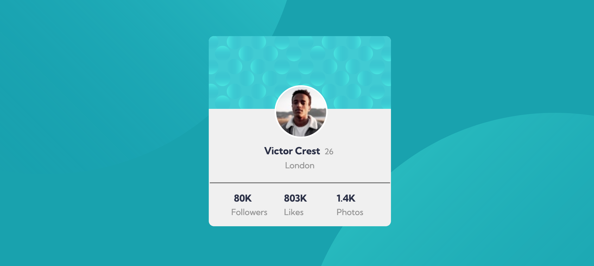

# Frontend Mentor - Profile card component solution

This is a solution to the [Profile card component challenge on Frontend Mentor](https://www.frontendmentor.io/challenges/profile-card-component-cfArpWshJ). Frontend Mentor challenges help you improve your coding skills by building realistic projects.

## Table of contents

- [Overview](#overview)
  - [The challenge](#the-challenge)
  - [Screenshot](#screenshot)
  - [Links](#links)
- [My process](#my-process)
  - [Built with](#built-with)
  - [What I learned](#what-i-learned)
  - [Continued development](#continued-development)
- [Author](#author)

## Overview

Having done a few challenges similar to this one I am comfortable with most css styling. It was by far easy to work on this challenge apart from having some challenge centering the container.

### The challenge

- Build out the project to the designs provided

### Screenshot

### Links

- Solution URL: [Github](https://github.com/Maryahcee/profile-card-component)
- Live Site URL: [Netlify links](https://profile-card-component-maryah.netlify.app/)

## My process

First I made a draft of all the containers needed. I made a sketch of step by step precess.
worked on the HTML then css for styling the card to be as needed.

### Built with

- Semantic HTML5 markup
- CSS custom properties
- Flexbox
- desktop first workflow

### What I learned

How to use the table practically in a real project.

### Continued development

Working on flex-box.

## Author

- Website - [Mary Njoroge]
- Frontend Mentor - [@Maryahcee](https://www.frontendmentor.io/profile/Maryahcee)
